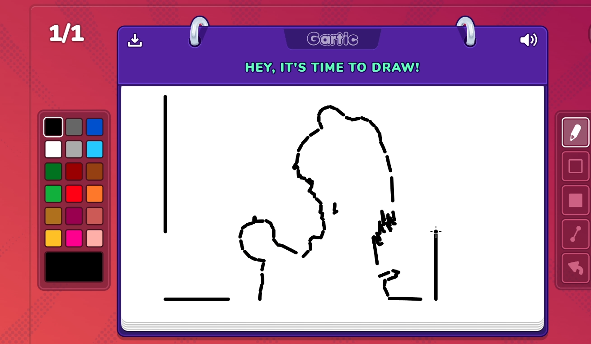

# Bad Apple!! but on Gartic Phone

[Gartic Phone](https://garticphone.com/) is an online multiplayer game.
The game is basically a mix of Pictionary and the Telephone.
One of its gamemodes is called Masterpiece where user draw a single piece of art without any time limit.
This gamemode is used in this project.

<p align="center">
  
</p>

## Installation

Make sure to check [requirements.txt](requirements.txt) before using!

## Usage

Begin by opening [Gartic Phone](https://garticphone.com/) in your browser of choice and click "Start".
It is then recommended to choose the "Masterpiece" preset as it gives you unlimited time.

Run the program
```bash
python main.py
```

Check [Inputting](#Inputting) for documentation

Quickly switch back to Gartic Phone. By default, you have three seconds before the rendering starts.

If you want to manually exit the program at any time, you must quickly move your cursor to the corner of your screen.

## Inputting

You may choose either to input a CSV file or to manually input each value.
Check [input.csv](input.csv) for example input configuration

### Values

* video_path [string] | Path to video being rendered


* width [integer] | Width of render. Do not make this any larger than the width of the Gartic Phone canvas


* height [integer] | Height of render. Do not make this any larger than the height of the Gartic Phone canvas


* start_x [integer] | Starting pixel x coordinate. This should go somewhere within the canvas width range. Remember that coordinates start at (0, 0) from the top left corner of the screen


* start_y [integer] | Starting pixel y coordinate. This should go somewhere within the canvas height range. Remember that coordinates start at (0, 0) from the top left corner of the screen


* draw_speed [float] | Length of the delay in seconds between drawing each contour. The lower the number, the faster. By default, the minimum value is 0.15. Anything lower will likely ruin the quality of the drawing while also making the program more challenging to exit manually